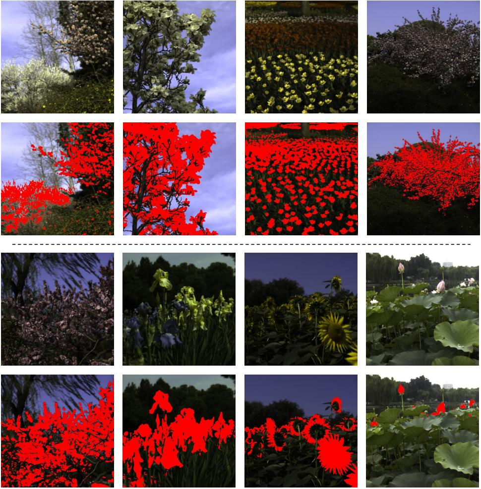
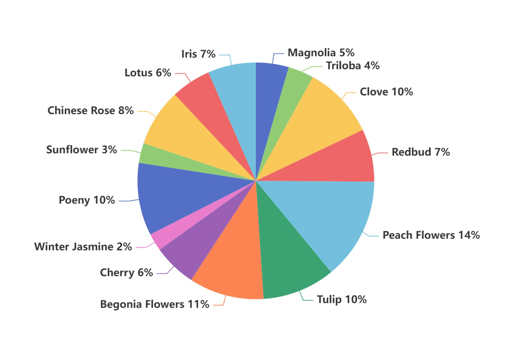

# FHRS: The First Flower Hyperspectral Image Dataset with Semantic Annotations

## 🌸 Introduction

**FHRS (Flower Hyperspectral Image Dataset)** is the first publicly available dataset that provides:
- 🌼 Hyperspectral images of flowers captured in natural scenes
- 🌿 Corresponding RGB images
- 🎨 High-quality fine-grained segmentation annotations

This dataset enables research in **hyperspectral image recovery**, **semantic segmentation**, and their **mutual enhancement** by exploring the complementary relationship between spectral and semantic information.



### 🌟 Why FHRS?
Hyperspectral images (HSIs) provide **continuous spectral information**, allowing differentiation between objects with similar textures but different spectral properties. However, HSIs are challenging to acquire due to high costs, long exposure times, and complex instrumentation.

On the other hand, **RGB images are the most commonly used image modality** but lack spectral information, making segmentation challenging in cases where similar colors belong to different categories.

To bridge this gap, FHRS enables **simultaneous spectral recovery and semantic segmentation**, improving both tasks by leveraging their complementary nature.

## 🏗 Dataset Overview



FHRS consists of:

- 📁 **Hyperspectral images (HSI)**: High-quality images captured using a professional hyperspectral camera.
- 📷 **RGB images**: Corresponding RGB images extracted from hyperspectral data.
- 🏷 **Segmentation annotations**: Pixel-wise annotated masks for flower regions.
- 🔍 **Metadata**: Acquisition details and spectral bands information.

### 📂 Dataset Structure
```plaintext
FHRS/
├── hsi_train/ hsi_val/   # Raw hyperspectral images
├── rgb/            # Corresponding RGB images
├── gts/          # Semantic segmentation annotations
└── code          # code for CSSF and other comparing methods
```

## 🚀 Applications

FHRS is useful for various research applications, including:

- **Spectral recovery from RGB**: Reconstructing hyperspectral data from RGB images.
- **Semantic segmentation**: Improving segmentation by utilizing spectral information.
- **Hyperspectral image analysis**: Studying spectral properties of flowers for agriculture, botany, and ecological research.
- **Multi-task learning**: Joint training on spectral recovery and segmentation tasks.

## 📌 Our Approach: CSSF Framework

We propose a **Complementary Spectral-Semantic Fusion (CSSF) model**, a **multi-task learning framework** designed to improve spectral recovery and semantic segmentation **simultaneously**. It consists of:

- 🔳 **Window-based Spectral-Semantic Attentive Fusion (WSSAF) module**: Effectively integrates recovered spectral information into the segmentation process.
- 🔄 **Pixel-Shuffle-Based Fusion (PSF) module**: Uses semantic features to guide spectral recovery.

## 📊 Benchmark Results

We evaluated our approach on FHRS and LIB-HSI datasets, demonstrating that:
- 🌟 Spectral recovery enhances **semantic segmentation accuracy**.
- 🎯 Semantic segmentation improves the **quality of recovered hyperspectral data**.
- 🚀 The proposed CSSF model achieves **state-of-the-art performance** in both tasks.

## 🔽 Download Dataset

You can download the FHRS dataset from the following link:

👉 **[Download FHRS Dataset](https://pan.baidu.com/s/1cbPuVo7ZDw_hTWoEFb-RWw?pwd=4knx)**

## 📜 Citation

If you use FHRS dataset in your research, please cite our work:

```bibtex
@article{fhrs_hsi,
  author    = {Zhuoran Du, Shikui Wei, Ting Liu, Shunli Zhang, Xiaotong Chen, Yao Zhao},
  title     = {Exploring the applicability of spectral recovery in semantic segmentation of RGB images},
  journal   = {TMM},
  year      = {2022}
}
